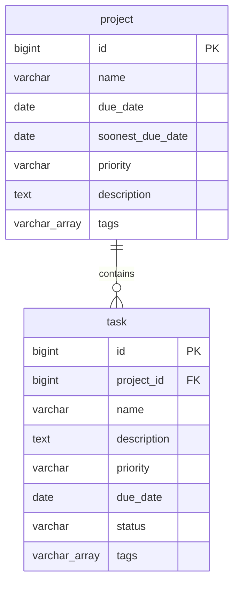

# Database Schema

Planning document for the task manager database. Update this file as models and migrations evolve.

**Database:** PostgreSQL ([stack.md](./stack.md)) · **Django app:** `tasks`

---

## Overview


| Table     | Purpose                                       |
| --------- | --------------------------------------------- |
| `project` | Top-level container for related work items    |
| `task`    | Individual work item belonging to one project |


One project has many tasks. Each task belongs to exactly one project.




---

## Enums

Adjust values here before updating Django `TextChoices`.

### Priority (`priority`)


| Value       | Label     | Notes   |
| ----------- | --------- | ------- |
| `very_low`  | Very low  |         |
| `low`       | Low       | Default |
| `medium`    | Medium    |         |
| `high`      | High      |         |
| `very_high` | Very high |         |


### Task status (`status`)


| Value         | Label       | Notes   |
| ------------- | ----------- | ------- |
| `todo`        | To do       | Default |
| `in_progress` | In progress |         |
| `done`        | Done        |         |
| `cancelled`   | Cancelled   |         |


### Tags (`tags`)

Optional list of up to **3** short labels on both `project` and `task`.


| Property   | Value                              |
| ---------- | ---------------------------------- |
| Type       | `VARCHAR(50)[]` (PostgreSQL array) |
| Max length | 3 elements                         |
| Empty      | `{}` or `NULL` — both mean no tags |


---

## `project`


| Column        | Type            | Constraints              |
| ------------- | --------------- | ------------------------ |
| `id`          | `BIGSERIAL`     | PK                       |
| `name`        | `VARCHAR(255)`  | NOT NULL                 |
| `due_date`          | `DATE`          | NULL allowed             |
| `soonest_due_date`  | `DATE`          | NULL allowed             |
| `priority`          | `VARCHAR(20)`   | NOT NULL, default `low`  |
| `description` | `TEXT`          | NULL allowed             |
| `tags`        | `VARCHAR(50)[]` | Max 3 elements           |
| `created_at`  | `TIMESTAMPTZ`   | NOT NULL, auto on insert |
| `updated_at`  | `TIMESTAMPTZ`   | NOT NULL, auto on update |


| Index                  | Columns    | Type   | Purpose              |
| ---------------------- | ---------- | ------ | -------------------- |
| `project_due_date_idx`         | `due_date`         | B-tree | Due-date list filter              |
| `project_soonest_due_date_idx` | `soonest_due_date` | B-tree | Sort/filter by nearest task deadline |
| `project_tags_gin_idx`         | `tags`             | GIN    | Tag search / filter               |


---

## `task`


| Column       | Type            | Constraints                 |
| ------------ | --------------- | --------------------------- |
| `id`         | `BIGSERIAL`     | PK                          |
| `project_id` | `BIGINT`        | NOT NULL, FK → `project.id` |
| `name`       | `VARCHAR(255)`  | NOT NULL                    |
| `description` | `TEXT`          | NULL allowed                |
| `priority`   | `VARCHAR(20)`   | NOT NULL, default `low`     |
| `due_date`   | `DATE`          | NULL allowed                |
| `status`     | `VARCHAR(20)`   | NOT NULL, default `todo`    |
| `tags`       | `VARCHAR(50)[]` | Max 3 elements              |
| `created_at` | `TIMESTAMPTZ`   | NOT NULL, auto on insert    |
| `updated_at` | `TIMESTAMPTZ`   | NOT NULL, auto on update    |


| Column       | References    | On delete |
| ------------ | ------------- | --------- |
| `project_id` | `project(id)` | `CASCADE` |


| Index                 | Columns      | Type   | Purpose               |
| --------------------- | ------------ | ------ | --------------------- |
| `task_project_id_idx` | `project_id` | B-tree | Tasks for one project   |
| `task_due_date_idx`   | `due_date`   | B-tree | Task due-date queries   |
| `task_tags_gin_idx`   | `tags`       | GIN    | Tag search / filter     |


### `soonest_due_date` (project)

Denormalized copy of the earliest `due_date` among the project's tasks. Updated by application logic when tasks are created, edited, or deleted (not a database trigger).

| Property | Value                                      |
| -------- | ------------------------------------------ |
| Type     | `DATE`                                     |
| Empty    | `NULL` when the project has no dated tasks |

---

## Django mapping

```python
class Priority(models.TextChoices):
    VERY_LOW = "very_low", "Very low"
    LOW = "low", "Low"
    MEDIUM = "medium", "Medium"
    HIGH = "high", "High"
    VERY_HIGH = "very_high", "Very high"


class TaskStatus(models.TextChoices):
    TODO = "todo", "To do"
    IN_PROGRESS = "in_progress", "In progress"
    DONE = "done", "Done"
    CANCELLED = "cancelled", "Cancelled"


class Project(models.Model):
    name = models.CharField(max_length=255)
    due_date = models.DateField(null=True, blank=True)
    soonest_due_date = models.DateField(null=True, blank=True)
    priority = models.CharField(max_length=20, choices=Priority.choices, default=Priority.LOW)
    description = models.TextField(blank=True)
    tags = ArrayField(models.CharField(max_length=50), size=3, default=list, blank=True)
    created_at = models.DateTimeField(auto_now_add=True)
    updated_at = models.DateTimeField(auto_now=True)

    class Meta:
        indexes = [
            models.Index(fields=["due_date"], name="project_due_date_idx"),
            models.Index(fields=["soonest_due_date"], name="project_soonest_due_date_idx"),
            GinIndex(fields=["tags"], name="project_tags_gin_idx"),
        ]


class Task(models.Model):
    project = models.ForeignKey(Project, on_delete=models.CASCADE, related_name="tasks")
    name = models.CharField(max_length=255)
    description = models.TextField(blank=True)
    priority = models.CharField(max_length=20, choices=Priority.choices, default=Priority.LOW)
    due_date = models.DateField(null=True, blank=True)
    status = models.CharField(max_length=20, choices=TaskStatus.choices, default=TaskStatus.TODO)
    tags = ArrayField(models.CharField(max_length=50), size=3, default=list, blank=True)
    created_at = models.DateTimeField(auto_now_add=True)
    updated_at = models.DateTimeField(auto_now=True)

    class Meta:
        indexes = [
            models.Index(fields=["project_id"], name="task_project_id_idx"),
            models.Index(fields=["due_date"], name="task_due_date_idx"),
            GinIndex(fields=["tags"], name="task_tags_gin_idx"),
        ]
```

